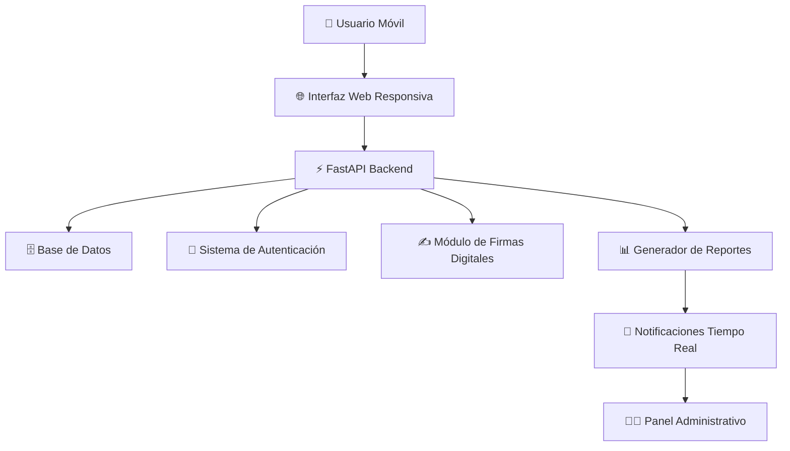

# Automatización ETCAR 🚀

---

## 💡 Visión del Proyecto

Sistema de automatización de formularios empresariales que transforma procesos manuales en flujos digitales eficientes, eliminando la dependencia de Excel no estandarizado y los procesos presenciales de firma.

> **🎯 Objetivo:** Crear una solución integral que modernice la gestión de formularios de mantenimiento empresarial, reduciendo errores humanos y optimizando tiempos de respuesta.

---

## 🔍 Análisis del Problema Actual

### Desafíos Identificados en las Empresas

🔴 **Falta de Estandarización**
- Cada empleado maneja su propia versión de Excel con formatos diferentes
- Inconsistencia en la captura y organización de datos
- Dificultad para consolidar información de múltiples fuentes

🔴 **Barreras Tecnológicas**
- Los empleados tienen dificultades para usar Excel eficientemente
- Problemas de compatibilidad y usabilidad en dispositivos móviles
- Limitaciones de acceso remoto a documentos

🔴 **Procesos Presenciales Ineficientes**
- Necesidad de desplazarse físicamente para entregar documentos
- Pérdida de tiempo en procesos de firma manual
- Dependencia de horarios y disponibilidad física de administradores

🔴 **Alto Riesgo de Errores**
- Procesos manuales propensos a errores humanos
- Pérdida o deterioro de documentos físicos
- Dificultad para rastrear el estado de los formularios

---

## ✨ Propuesta de Solución

**Automatización** emerge como una solución tecnológica integral que revoluciona la gestión de formularios de mantenimiento de maquinaria a través de la digitalización completa del proceso.

### 🎯 Funcionalidades Principales

| Característica | Beneficio | Impacto |
|---|---|---|
| **📱 Interfaz Móvil Optimizada** | Acceso desde cualquier dispositivo | +90% accesibilidad |
| **✍️ Firmas Digitales** | Eliminación de procesos presenciales | -100% desplazamientos |
| **📊 Estandarización de Datos** | Formularios uniformes y validados | -80% errores de captura |
| **⚡ Tiempo Real** | Transferencia instantánea de información | -70% tiempo de procesamiento |
| **📈 Reportes Automáticos** | Generación automática con firmas digitales | +95% eficiencia administrativa |

---

## 🛠️ Stack Tecnológico

### Backend

### Base de Datos

### Frontend

### Autenticación & Seguridad

---

## 📊 Métricas Esperadas de Impacto

### 🚀 Eficiencia Operativa
- **Tiempo de Procesamiento:** Reducción estimada del 80%
- **Disponibilidad:** Acceso 24/7 desde cualquier ubicación
- **Movilidad:** 100% compatible con dispositivos móviles

### 📈 Calidad de Datos
- **Precisión:** Reducción del 90% en errores de captura
- **Consistencia:** Estandarización del 100% de formularios
- **Trazabilidad:** Seguimiento completo del ciclo de vida

### 💼 Beneficios Administrativos
- **Automatización:** Generación automática de reportes
- **Compliance:** Registro digital con validez legal
- **Sostenibilidad:** Reducción del 100% en uso de papel

---

## 🏗️ Arquitectura del Sistema

---

## 🎯 Casos de Uso Principales

### Para Empleados de Campo
1. **Acceso Móvil** - Abrir formulario desde smartphone/tablet
2. **Captura Estandarizada** - Llenar campos validados automáticamente
3. **Firma Digital** - Aplicar firma electrónica con validez legal
4. **Envío Instantáneo** - Transmisión automática al supervisor

### Para Administradores
1. **Recepción en Tiempo Real** - Notificaciones instantáneas de nuevos formularios
2. **Revisión Digital** - Validación y aprobación desde cualquier ubicación
3. **Firma de Aprobación** - Aplicación de firma digital administrativa
4. **Generación de Reportes** - Creación automática de documentos consolidados

---

## 🚀 Estado Actual del Desarrollo

### ✅ Completado
- [x] Análisis de requerimientos empresariales
- [x] Diseño de arquitectura inicial
- [x] Configuración del entorno de desarrollo
- [x] Desarrollo de API REST con FastAPI
- [x] Diseño de base de datos
- [x] Implementación de autenticación
- [x] Desarrollo de interfaz móvil
- [x] Módulo de firmas digitales
- [x] Sistema de reportes automáticos
- [x] Panel administrativo

### 🔄 En Desarrollo
- [ ] Sistema de notificacion por correo
- [ ] Graficas de KPIs
- [ ] Modelo de ML para predecir frecuencia de revision

### 📋 Próximas Fases
- [ ] Realizar pruebas en un entorno laboral
---

## 🔮 Roadmap Futuro

### Fase 1: MVP (Producto Mínimo Viable)
- Formularios básicos de mantenimiento
- Autenticación simple
- Firmas digitales básicas

### Fase 2: Características Avanzadas
- Dashboard administrativo completo
- Reportes personalizables
- Integración con sistemas existentes

### Fase 3: Escalabilidad Empresarial
- Multi-tenancy para múltiples empresas
- API para integraciones externas
- Análisis predictivo de mantenimiento

---

## 📞 Información del Proyecto

**Estado:** 🔬 MVP completado
**Licencia:** En Definición  
**Fecha de Inicio:** 2025  

---

## 🌟 Impacto Esperado

> *"Transformar la gestión de formularios empresariales de un proceso manual propenso a errores, a un flujo digital eficiente, accesible y confiable que empodere tanto a empleados como administradores."*

---

⚠️ **Nota:** Este es un proyecto en fase de prototipo. La información y características están sujetas a cambios durante el desarrollo.

🔄 **Última Actualización:** Junio 2025
